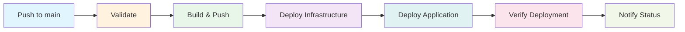

# Production Deployment Guide 🚀

> **Complete guide for deploying the Azure PostgreSQL Notes Application to production using the enhanced CI/CD pipeline.**

Last Updated: 2024  
Workflow: `deploy-azure-infrastructure.yml`  
Version: Production-Ready v2.0

---

## 📋 Table of Contents

1. [Overview](#overview)
2. [Prerequisites](#prerequisites)
3. [Quick Start](#quick-start)
4. [Deployment Methods](#deployment-methods)
5. [Workflow Stages](#workflow-stages)
6. [Configuration](#configuration)
7. [Monitoring & Verification](#monitoring--verification)
8. [Troubleshooting](#troubleshooting)
9. [Rollback Procedures](#rollback-procedures)

---

## Overview

The **Deploy Azure Infrastructure & Application** workflow provides end-to-end deployment automation with comprehensive validation, monitoring, and error handling.

### Key Features

- ✅ **6-Stage Pipeline**: Validate → Build → Provision → Deploy → Verify → Notify
- 🔄 **Automated Rollback**: Built-in failure handling and rollback instructions
- 🧪 **Local Testing**: Three-tier testing system for pre-deployment validation
- 📊 **Rich Reporting**: GitHub Step Summaries with detailed deployment info
- 🔐 **Security**: Azure credentials managed via GitHub Secrets
- 🌍 **Multi-Environment**: Support for dev/staging/prod environments
- ⚡ **Performance**: Docker layer caching and parallel job execution

### Architecture



---

## Prerequisites

### 1. Azure Resources

Ensure the following Azure resources exist:

- **Resource Group**: `notesapp-dev-rg`
- **Container Registry**: `notesappdevacr.azurecr.io`
- **Service Principal**: With Contributor access
- **Storage Account**: For Terraform state (optional but recommended)

### 2. GitHub Repository Setup

Required GitHub Secrets (see [SECRETS_SETUP.md](SECRETS_SETUP.md)):

| Secret | Description | Example |
|--------|-------------|---------|
| `AZURE_CREDENTIALS` | Service Principal JSON | `{"clientId":"...","clientSecret":"...","subscriptionId":"...","tenantId":"..."}` |
| `ARM_CLIENT_ID` | Azure Client ID | `12345678-1234-1234-1234-123456789abc` |
| `ARM_CLIENT_SECRET` | Azure Client Secret | `your-secret-value` |
| `ARM_SUBSCRIPTION_ID` | Azure Subscription ID | `87654321-4321-4321-4321-cba987654321` |
| `ARM_TENANT_ID` | Azure Tenant ID | `abcdef12-3456-7890-abcd-ef1234567890` |
| `DB_PASSWORD` | PostgreSQL admin password | `SecureP@ssw0rd123!` |

### 3. Local Development Tools

For local testing and debugging:

- **Docker Desktop**: Running and authenticated
- **Terraform**: v1.5 or higher
- **Azure CLI**: Latest version
- **Node.js**: v20 or higher
- **act** (optional): For running GitHub Actions locally

---

## Quick Start

### Deploy to Production (Automated)

```bash
# 1. Ensure you're on the main branch
git checkout main

# 2. Make your changes
git add .
git commit -m "feat: your changes"

# 3. Push to trigger deployment
git push origin main

# The workflow will automatically:
# - Validate code and infrastructure
# - Build and push Docker image
# - Deploy infrastructure with Terraform
# - Deploy application to Azure Web App
# - Verify deployment health
# - Report status
```

### Manual Deployment Trigger

Use GitHub Actions UI for manual deployments:

1. Navigate to: **Actions** → **Deploy Azure Infrastructure & Application**
2. Click **Run workflow**
3. Select:
   - **Branch**: `main`
   - **Environment**: `dev`, `staging`, or `prod`
   - **Skip verification**: `false` (recommended to keep enabled)
4. Click **Run workflow**

---

## Deployment Methods

### Method 1: Automated (Recommended)

**Trigger**: Push to `main` branch

```bash
git push origin main
```

**Process**:
1. GitHub Actions automatically triggered
2. All 6 stages run sequentially
3. Deployment status reported via GitHub Summary
4. Email notification on completion

**Pros**:
- Fully automated
- No manual intervention
- Consistent deployments
- Audit trail in GitHub

### Method 2: Manual Trigger

**Trigger**: GitHub Actions UI

**Process**:
1. Go to Actions tab
2. Select workflow
3. Choose environment
4. Run workflow

**Pros**:
- Control over timing
- Environment selection
- Can skip verification if needed

### Method 3: Local Testing Before Push

**Three-Tier Testing System**:

```bash
# Tier 1: Fast validation and deployment (5-10 minutes)
./scripts/deploy.sh all

# Tier 2: Simulate CI/CD pipeline (~95% accuracy, 15-30 minutes)
./scripts/test-cicd-local.sh all

# Tier 3: Run actual GitHub Actions locally (100% accuracy, 20-35 minutes)
./scripts/run-act.sh all
```

**Comparison**:

| Tool | Speed | Accuracy | Best For |
|------|-------|----------|----------|
| `deploy.sh` | ⚡⚡⚡ Fast | ~90% | Quick iterations |
| `test-cicd-local.sh` | ⚡⚡ Medium | ~95% | Pre-push validation |
| `run-act.sh` | ⚡ Slow | 100% | Final validation |

---

## Workflow Stages

### Stage 1: Validate Code & Infrastructure

**Purpose**: Ensure code quality and infrastructure configuration

**Steps**:
1. ✅ Checkout code
2. ✅ Setup Node.js 20
3. ✅ Install dependencies
4. ✅ Run linting
5. ✅ Run tests
6. ✅ Setup Terraform
7. ✅ Terraform format check
8. ✅ Terraform init (validation only)
9. ✅ Terraform validate

**Duration**: ~2-3 minutes

**Outputs**: Validation summary table

### Stage 2: Build & Push Docker Image

**Purpose**: Build containerized application and push to ACR

**Steps**:
1. 🐳 Setup Docker Buildx
2. 🔐 Authenticate with Azure
3. 🔐 Login to ACR
4. 🏷️ Extract Docker metadata
5. 🐳 Build multi-arch image with caching
6. 📤 Push to registry

**Tags Generated**:
- `latest` (main branch only)
- `main-<sha>` (commit SHA)
- `main` (branch name)
- `YYYYMMDD-HHmmss` (timestamp)

**Duration**: ~3-5 minutes (with cache), ~8-12 minutes (without)

**Outputs**: Image digest, tags, pull command

### Stage 3: Deploy Infrastructure

**Purpose**: Provision/update Azure infrastructure with Terraform

**Steps**:
1. 🏗️ Setup Terraform
2. 🔐 Azure login
3. 🔧 Terraform init (with backend)
4. 📋 Terraform plan (with output capture)
5. 🚀 Terraform apply
6. 📤 Extract outputs (app URL, DB host, webapp name)

**Resources Managed**:
- Virtual Network & Subnets
- PostgreSQL Flexible Server
- App Service Plan
- App Service (Web App)
- Private DNS Zones
- Network Security Groups

**Duration**: ~5-10 minutes (update), ~15-20 minutes (create)

**Outputs**: Infrastructure details table

### Stage 4: Deploy Application

**Purpose**: Deploy Docker container to Azure Web App

**Steps**:
1. 🔐 Azure login
2. 🔍 Get Web App name
3. 🚀 Deploy container
4. 🔄 Restart Web App

**Duration**: ~2-3 minutes

**Outputs**: Deployment details (webapp, image, digest)

### Stage 5: Verify Deployment

**Purpose**: Validate application health and functionality

**Steps**:
1. ⏳ Wait for startup (30 seconds)
2. 🏥 Health check with retries (up to 5 attempts)
3. 🧪 Test notes endpoint
4. 🔍 Test database connection

**Health Check Details**:
- **Endpoint**: `/health`
- **Retries**: 5 attempts
- **Backoff**: Exponential (10s, 20s, 30s, 40s, 50s)
- **Success**: HTTP 200
- **Failure**: Exit code 1

**Duration**: ~1-2 minutes (success), ~3-4 minutes (with retries)

**Outputs**: Verification summary with quick links

### Stage 6: Notify Deployment Status

**Purpose**: Report final deployment status and provide guidance

**Steps**:
1. 📊 Collect all stage results
2. 📊 Generate summary table
3. ✅ Success notification (if all passed)
4. ❌ Failure notification (if any failed)
5. 📋 Provide rollback instructions (if needed)

**Success Output**:
- Stage completion table
- Deployment metadata
- Next steps
- Monitoring links

**Failure Output**:
- Stage status table
- Troubleshooting links
- Local testing commands
- Rollback instructions

**Duration**: <1 minute

---

## Configuration

### Environment Variables

Set in workflow file (`.github/workflows/deploy-azure-infrastructure.yml`):

```yaml
env:
  ACR_NAME: notesappdevacr
  IMAGE_NAME: notesapp
  AZURE_REGION: westeurope
  TERRAFORM_VERSION: '~1.5'
  NODE_VERSION: '20'
```

### Workflow Inputs

Available for manual triggers:

```yaml
environment:
  - dev (default)
  - staging
  - prod

skip_verification:
  - false (default)
  - true
```

### Path Filters

Workflow **ignores** changes to:
- `docs/**` (documentation)
- `**.md` (markdown files)
- `.github/workflows/documentation.yml`

---

## Monitoring & Verification

### Real-Time Monitoring

#### GitHub Actions UI

1. Navigate to **Actions** tab
2. Select running workflow
3. View live logs
4. Check step summaries

#### Azure Portal

1. Open [Azure Portal](https://portal.azure.com)
2. Navigate to resource group: `notesapp-dev-rg`
3. Check resources:
   - **App Service**: Deployment logs
   - **Container Registry**: Image tags
   - **PostgreSQL**: Connection metrics
   - **Monitor**: Application insights

### Post-Deployment Verification

#### Manual Health Check

```bash
# Get app URL from Terraform output or Azure Portal
APP_URL="https://your-app.azurewebsites.net"

# Test health endpoint
curl -v $APP_URL/health

# Expected response: HTTP 200
# {"status":"healthy","database":"connected"}
```

#### Test Notes API

```bash
# List notes
curl $APP_URL/notes

# Create note
curl -X POST $APP_URL/notes \
  -H "Content-Type: application/json" \
  -d '{"title":"Test Note","content":"Deployment verification"}'

# Get specific note
curl $APP_URL/notes/1
```

#### View Application Logs

```bash
# Azure CLI
az webapp log tail \
  --name <webapp-name> \
  --resource-group notesapp-dev-rg

# Or stream logs
az webapp log download \
  --name <webapp-name> \
  --resource-group notesapp-dev-rg \
  --log-file logs.zip
```

### Key Metrics to Monitor

1. **Response Time**: < 500ms (health endpoint)
2. **Error Rate**: < 1%
3. **Database Connections**: Healthy
4. **Memory Usage**: < 80%
5. **HTTP Status**: 200 for all endpoints

---

## Troubleshooting

### Common Issues

#### 1. Validation Stage Fails

**Symptoms**: Terraform format check fails

**Solution**:
```bash
# Format Terraform files
cd infra
terraform fmt -recursive

# Commit and push
git add .
git commit -m "fix: format Terraform files"
git push origin main
```

#### 2. Build Stage Fails

**Symptoms**: ACR authentication errors

**Solution**:
```bash
# Verify ACR credentials
az acr login --name notesappdevacr

# Check GitHub secret AZURE_CREDENTIALS
# Ensure it contains valid service principal JSON
```

#### 3. Infrastructure Stage Fails

**Symptoms**: Terraform errors, resource conflicts

**Solution**:
```bash
# Check Terraform state
cd infra
terraform state list

# Import existing resources if needed
terraform import azurerm_resource_group.main /subscriptions/{sub-id}/resourceGroups/notesapp-dev-rg

# Apply manually to debug
terraform plan
terraform apply
```

#### 4. Deployment Stage Fails

**Symptoms**: Web App deployment errors

**Solution**:
```bash
# Check Web App exists
az webapp list --resource-group notesapp-dev-rg

# Verify ACR integration
az webapp config container show \
  --name <webapp-name> \
  --resource-group notesapp-dev-rg

# Check logs
az webapp log tail \
  --name <webapp-name> \
  --resource-group notesapp-dev-rg
```

#### 5. Verification Stage Fails

**Symptoms**: Health check timeouts, HTTP errors

**Solution**:
```bash
# Check application logs
az webapp log tail --name <webapp-name> --resource-group notesapp-dev-rg

# Verify database connection
az postgres flexible-server show \
  --resource-group notesapp-dev-rg \
  --name <db-name>

# Check network connectivity
az webapp show \
  --name <webapp-name> \
  --resource-group notesapp-dev-rg \
  --query "outboundIpAddresses"
```

### Debug Locally

Use the three-tier testing system:

```bash
# Quick debug
./scripts/deploy.sh verify

# Full pipeline simulation
./scripts/test-cicd-local.sh all

# Exact GitHub Actions replication
./scripts/run-act.sh validate
./scripts/run-act.sh build
./scripts/run-act.sh infra
```

### Get Help

1. **Documentation**: 
   - [Troubleshooting Guide](../docs/TROUBLESHOOTING.md)
   - [Architecture Docs](../docs/ARCHITECTURE.md)
   - [Deployment Guide](../docs/DEPLOYMENT.md)

2. **Logs**:
   - GitHub Actions: View workflow run logs
   - Azure Portal: App Service logs
   - Terraform: `.terraform/terraform.tfstate`

3. **Support**:
   - Check [Issues](https://github.com/kozuchowskihubert/azure-psql-app/issues)
   - Review [Discussions](https://github.com/kozuchowskihubert/azure-psql-app/discussions)

---

## Rollback Procedures

### Automated Rollback (Terraform)

If infrastructure deployment fails, Terraform automatically maintains the previous state.

### Manual Application Rollback

#### Option 1: Redeploy Previous Image

```bash
# Find previous working image
az acr repository show-tags \
  --name notesappdevacr \
  --repository notesapp \
  --orderby time_desc

# Deploy specific tag
az webapp config container set \
  --name <webapp-name> \
  --resource-group notesapp-dev-rg \
  --docker-custom-image-name notesappdevacr.azurecr.io/notesapp:main-<previous-sha>

# Restart
az webapp restart \
  --name <webapp-name> \
  --resource-group notesapp-dev-rg
```

#### Option 2: Redeploy Previous Commit

```bash
# Find last working commit
git log --oneline -n 10

# Checkout and deploy
git checkout <commit-sha>
./scripts/deploy.sh all

# Or create new deployment
git revert <bad-commit-sha>
git push origin main  # Triggers new deployment
```

#### Option 3: Full Infrastructure Rollback

```bash
# Restore previous Terraform state
cd infra
terraform state pull > current-state.backup

# Get previous state from Azure Storage (if using remote backend)
az storage blob download \
  --account-name <storage-account> \
  --container-name tfstate \
  --name terraform.tfstate \
  --file previous-state.tfstate

# Apply previous state
terraform state push previous-state.tfstate
terraform apply
```

### Emergency Procedures

#### Complete Service Outage

1. **Immediate**: Set maintenance page
2. **Investigate**: Check logs and metrics
3. **Decide**: Rollback or fix-forward
4. **Execute**: Use appropriate rollback method
5. **Verify**: Test all endpoints
6. **Document**: Post-mortem analysis

#### Database Issues

```bash
# Check database status
az postgres flexible-server show \
  --resource-group notesapp-dev-rg \
  --name <db-name>

# Restore from backup (if needed)
az postgres flexible-server restore \
  --resource-group notesapp-dev-rg \
  --name <db-name>-restored \
  --source-server <db-name> \
  --restore-time "2024-01-01T00:00:00Z"
```

---

## Best Practices

### Pre-Deployment

1. ✅ Run local tests first
2. ✅ Review Terraform plan
3. ✅ Check secrets are up-to-date
4. ✅ Verify ACR has space
5. ✅ Schedule during low-traffic window

### During Deployment

1. 👀 Monitor GitHub Actions logs
2. 👀 Watch Azure Portal metrics
3. 👀 Keep communication channels open
4. 👀 Have rollback plan ready

### Post-Deployment

1. ✅ Verify health endpoints
2. ✅ Test critical user flows
3. ✅ Check application logs
4. ✅ Monitor for 30 minutes
5. ✅ Document any issues
6. ✅ Update runbook if needed

---

## Related Documentation

- [Architecture Guide](../docs/ARCHITECTURE.md) - System design and components
- [Deployment Guide](../docs/DEPLOYMENT.md) - Detailed deployment procedures
- [Troubleshooting Guide](../docs/TROUBLESHOOTING.md) - Common issues and solutions
- [Secrets Setup](SECRETS_SETUP.md) - GitHub secrets configuration
- [CI/CD Improvements](CI_CD_IMPROVEMENTS.md) - Pipeline enhancements
- [Act Usage Guide](../docs/ACT_USAGE.md) - Local GitHub Actions testing

---

## Appendix

### Workflow File Location

```
.github/workflows/deploy-azure-infrastructure.yml
```

### Key Scripts

```bash
scripts/deploy.sh                # Unified deployment
scripts/test-cicd-local.sh       # Pipeline simulation
scripts/run-act.sh               # Local GitHub Actions
scripts/run-local.sh             # Local development
```

### Support Contacts

- **Technical Issues**: GitHub Issues
- **Security**: security@example.com
- **Emergency**: oncall@example.com

---

**Last Updated**: 2024  
**Maintained By**: DevOps Team  
**Version**: 2.0 (Production-Ready)
