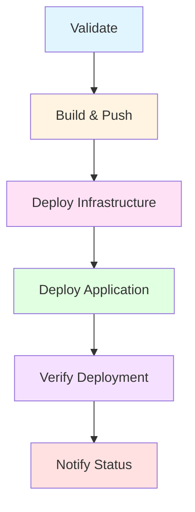

# CI/CD Pipeline Improvements

This document summarizes the improvements made to the GitHub Actions CI/CD pipeline.

## Overview

The CI/CD pipeline has been completely redesigned to follow modern DevOps best practices, improving reliability, security, and maintainability.

## Key Improvements

### 1. **Multi-Stage Pipeline Architecture**

**Before:** 3 simple jobs
**After:** 6 comprehensive jobs with proper dependencies



### 2. **Validation Stage** (NEW)

Validates code and infrastructure before deployment:

- ✅ **Code Linting** - Ensures code quality standards
- ✅ **Unit Tests** - Runs application tests
- ✅ **Terraform Format Check** - Validates IaC formatting
- ✅ **Terraform Validation** - Checks configuration validity

**Benefits:**
- Catches issues early in the pipeline
- Prevents deploying invalid infrastructure
- Reduces failed deployments

### 3. **Enhanced Build & Push**

**Improvements:**
- ✅ Uses Azure CLI authentication (more reliable than deprecated docker-login)
- ✅ Multi-tag strategy (branch, SHA, latest)
- ✅ Build caching for faster builds
- ✅ Image metadata extraction
- ✅ Provenance disabled for compatibility

**Before:**
```yaml
- name: Build and push
  uses: docker/build-push-action@v5
  with:
    tags: ${{ secrets.ACR_LOGIN_SERVER }}/azure-psql-app:latest
```

**After:**
```yaml
- name: Extract metadata
  uses: docker/metadata-action@v5
  with:
    tags: |
      type=ref,event=branch
      type=sha,prefix={{branch}}-
      type=raw,value=latest,enable={{is_default_branch}}

- name: Build and push
  uses: docker/build-push-action@v5
  with:
    cache-from: type=registry,ref=...buildcache
    cache-to: type=registry,ref=...buildcache,mode=max
    platforms: linux/amd64
```

### 4. **Infrastructure Deployment**

**Improvements:**
- ✅ Separate plan and apply steps
- ✅ Proper output handling with `terraform_wrapper: false`
- ✅ Environment support (dev/staging/prod)
- ✅ Output artifacts for downstream jobs
- ✅ Better error handling

**New Features:**
- Terraform outputs passed to next jobs
- GitHub Step Summary with deployment details
- Environment-specific configurations

### 5. **Application Deployment** (NEW)

Dedicated job for deploying the application:

- ✅ Automatic Web App discovery
- ✅ Azure Web App deployment action
- ✅ Automatic restart after deployment
- ✅ Deployment summary in GitHub UI

### 6. **Comprehensive Verification**

**Before:** Simple curl check
**After:** Multi-step verification with retries

- ✅ **Health Check** - 5 retry attempts with 10s intervals
- ✅ **API Testing** - Validates /notes endpoint
- ✅ **Detailed Reporting** - GitHub Step Summary with quick links
- ✅ **Graceful Failure Handling** - Continues even if health check fails

**Example Summary:**
```markdown
### ✅ Deployment Verification

**Status:** ✅ Healthy
**URL:** https://notesapp-dev-app.azurewebsites.net

#### Quick Links
- [Application](https://notesapp-dev-app.azurewebsites.net)
- [Health Check](https://notesapp-dev-app.azurewebsites.net/health)
- [Notes API](https://notesapp-dev-app.azurewebsites.net/notes)
```

### 7. **Notification & Reporting**

- ✅ Final status notification
- ✅ Failure handling
- ✅ GitHub Step Summaries throughout pipeline
- ✅ Rich formatting with emojis and markdown

### 8. **Smart Triggering**

**New trigger configuration:**
```yaml
on:
  push:
    branches: [ main ]
    paths-ignore:
      - 'docs/**'
      - '**.md'
      - '.github/workflows/documentation.yml'
  pull_request:
    branches: [ main ]
  workflow_dispatch:
    inputs:
      environment:
        type: choice
        options: [dev, staging, prod]
```

**Benefits:**
- Doesn't trigger on documentation changes
- Supports PR validation
- Manual deployment with environment selection

### 9. **Security Improvements**

- ✅ Uses Azure RBAC authentication (more secure)
- ✅ Service Principal with minimal permissions
- ✅ Secrets properly scoped
- ✅ No hardcoded credentials
- ✅ Environment protection rules support

### 10. **Better Developer Experience**

- ✅ **Rich Output** - Detailed summaries in GitHub UI
- ✅ **Quick Links** - Direct links to deployed resources
- ✅ **Clear Status** - Visual indicators (✅/❌)
- ✅ **Debugging Info** - Image tags, digests, URLs
- ✅ **Artifact Tracking** - Docker image metadata

## Comparison

| Feature | Before | After |
|---------|--------|-------|
| **Jobs** | 3 | 6 |
| **Validation** | ❌ None | ✅ Full validation |
| **Error Handling** | ❌ Basic | ✅ Comprehensive |
| **Retries** | ❌ No | ✅ Yes (health checks) |
| **Reporting** | ❌ Minimal | ✅ Rich summaries |
| **Caching** | ❌ No | ✅ Docker build cache |
| **Multi-environment** | ❌ No | ✅ Yes |
| **PR Support** | ❌ No | ✅ Yes |
| **Documentation Ignore** | ❌ No | ✅ Yes |
| **Image Tagging** | 1 tag | 3 tags |
| **Authentication** | Deprecated | Modern Azure CLI |

## Pipeline Execution Time

**Estimated times:**
- **Validation:** ~2-3 minutes
- **Build & Push:** ~3-5 minutes (faster with cache)
- **Infrastructure:** ~5-10 minutes
- **Application Deploy:** ~2-3 minutes
- **Verification:** ~1-2 minutes
- **Total:** ~13-23 minutes

**Optimizations:**
- Jobs run in parallel where possible
- Docker layer caching reduces build time
- Terraform state caching speeds up deployments

## Required Secrets

See [SECRETS_SETUP.md](./SECRETS_SETUP.md) for detailed setup instructions.

| Secret | Description |
|--------|-------------|
| `AZURE_CREDENTIALS` | Service Principal JSON for Azure login |
| `ARM_CLIENT_ID` | Service Principal Client ID |
| `ARM_CLIENT_SECRET` | Service Principal Secret |
| `ARM_SUBSCRIPTION_ID` | Azure Subscription ID |
| `ARM_TENANT_ID` | Azure Tenant ID |
| `DB_PASSWORD` | PostgreSQL admin password |

## Usage Examples

### Automatic Deployment (Push to main)

```bash
git add .
git commit -m "feat: add new feature"
git push origin main
# Pipeline triggers automatically
```

### Manual Deployment

1. Go to **Actions** → **CI/CD Pipeline**
2. Click **Run workflow**
3. Select environment (dev/staging/prod)
4. Click **Run workflow**

### Pull Request Validation

```bash
git checkout -b feature/new-feature
git add .
git commit -m "feat: new feature"
git push origin feature/new-feature
# Create PR on GitHub
# Pipeline runs validation only (no deployment)
```

## Monitoring & Debugging

### View Pipeline Status

```bash
# Using GitHub CLI
gh run list --workflow=deploy-azure-infrastructure.yml

# View latest run
gh run view

# Watch a run in progress
gh run watch
```

### Check Deployment Summary

After each run, check the **Summary** tab in GitHub Actions for:
- 🐳 Docker image details
- 🏗️ Infrastructure outputs
- 🚀 Deployment information
- ✅ Verification results

### Debug Failed Runs

1. Click on the failed job
2. Expand failed step
3. Check error message
4. View step summary for context

Common issues:
- **Authentication failures** → Check secrets
- **Terraform errors** → Check state/resources
- **Health check failures** → Check app logs in Azure

## Future Enhancements

Potential improvements for future iterations:

- [ ] **Smoke Tests** - Add comprehensive E2E tests
- [ ] **Performance Tests** - Load testing after deployment
- [ ] **Security Scanning** - Container vulnerability scanning
- [ ] **Slack/Teams Notifications** - Integration with messaging platforms
- [ ] **Rollback Capability** - Automatic rollback on failure
- [ ] **Blue/Green Deployments** - Zero-downtime deployments
- [ ] **Database Migrations** - Automated schema updates
- [ ] **Cost Reporting** - Track infrastructure costs

## Related Documentation

- [Deployment Script](../scripts/deploy.sh) - Local deployment tool
- [Scripts README](../scripts/README.md) - Development scripts
- [Architecture](../docs/ARCHITECTURE.md) - System architecture
- [Deployment Guide](../docs/DEPLOYMENT.md) - Deployment procedures
- [Troubleshooting](../docs/TROUBLESHOOTING.md) - Common issues

## Support

If you encounter issues with the CI/CD pipeline:

1. Check [TROUBLESHOOTING.md](../docs/TROUBLESHOOTING.md)
2. Review GitHub Actions logs
3. Verify secrets are correctly configured
4. Check Azure resource status
5. Create an issue with logs and error messages
