# Azure PostgreSQL App - Architecture Documentation

## Table of Contents
- [Overview](#overview)
- [Architecture Diagram](#architecture-diagram)
- [Components](#components)
- [Infrastructure Design](#infrastructure-design)
- [Network Architecture](#network-architecture)
- [Security Model](#security-model)
- [Data Flow](#data-flow)

## Overview

This application is a containerized Node.js notes application deployed on Azure App Service with PostgreSQL Flexible Server as the database backend. The infrastructure is fully managed through Terraform and automated via GitHub Actions CI/CD pipeline.

### Key Features
- **Containerized Application**: Docker-based deployment for consistency
- **Managed Database**: Azure PostgreSQL Flexible Server with private networking
- **Infrastructure as Code**: Terraform for reproducible infrastructure
- **CI/CD Automation**: GitHub Actions for automated deployments
- **Private Networking**: VNet integration for secure database access

## Architecture Diagram

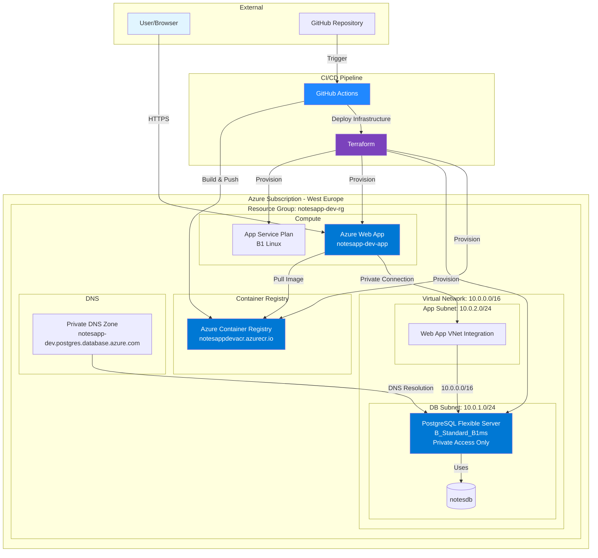

## Components

### 1. Application Layer

#### Azure Web App (App Service)
- **SKU**: B1 (Basic)
- **OS**: Linux
- **Runtime**: Docker Container
- **Location**: West Europe
- **Features**:
  - VNet Integration for private database access
  - Container Registry integration
  - Environment variable configuration
  - Application Insights (optional)

#### Docker Container
- **Base Image**: Node.js 18-alpine
- **Build**: Multi-stage build for optimization
- **Registry**: Azure Container Registry
- **Application**: Express.js REST API

### 2. Data Layer

#### PostgreSQL Flexible Server
- **SKU**: B_Standard_B1ms (Burstable)
- **Version**: 14
- **Storage**: 32 GB
- **Networking**: Private access only (no public endpoint)
- **Features**:
  - VNet integration via delegated subnet
  - Private DNS zone for name resolution
  - Automatic backups
  - High availability (configurable)

#### Database
- **Name**: notesdb
- **Charset**: UTF8
- **Collation**: en_US.utf8

### 3. Container Registry

#### Azure Container Registry (ACR)
- **SKU**: Basic
- **Admin Enabled**: Yes (for CI/CD)
- **Features**:
  - Docker image storage
  - Automatic image scanning (optional)
  - Geo-replication (upgradeable)

### 4. Networking

#### Virtual Network
- **Address Space**: 10.0.0.0/16
- **Subnets**:
  - **App Subnet** (10.0.2.0/24): For Web App VNet integration
  - **DB Subnet** (10.0.1.0/24): For PostgreSQL with delegation

#### Private DNS Zone
- **Zone**: notesapp-dev.postgres.database.azure.com
- **Purpose**: Private DNS resolution for PostgreSQL
- **Linked VNet**: notesapp-dev-vnet

### 5. CI/CD Components

#### GitHub Actions
- **Workflows**:
  - Build and push Docker image
  - Provision infrastructure via Terraform
  - Deploy application to App Service

#### Terraform
- **Backend**: Local state (upgradeable to Azure Storage)
- **Provider**: azurerm ~> 3.0
- **Resources Managed**: All infrastructure components

## Infrastructure Design

### Resource Hierarchy

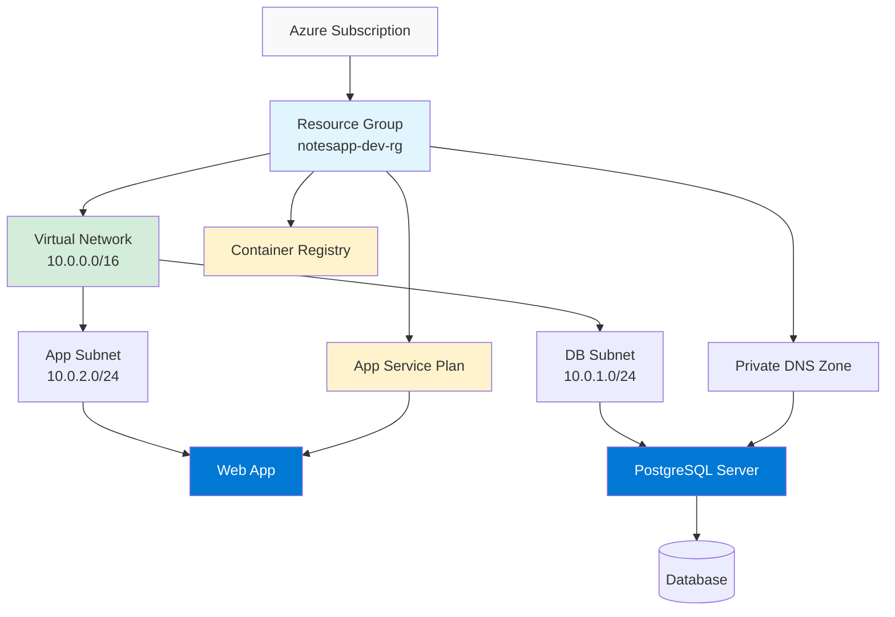

### Regional Design

**Primary Region**: West Europe
- **Rationale**: Selected due to quota restrictions in East US
- **Components**: All resources deployed in West Europe

**High Availability Considerations**:
- PostgreSQL: Supports zone-redundant HA (upgradeable)
- App Service: Multiple instances possible (scale up/out)
- ACR: Geo-replication available (upgradeable)

## Network Architecture

### Private Network Flow

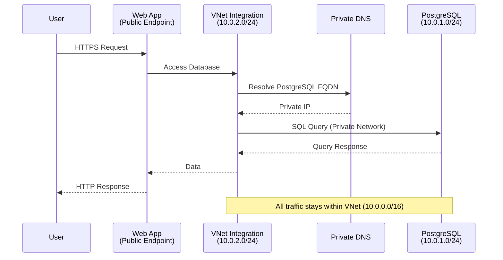

### Security Boundaries

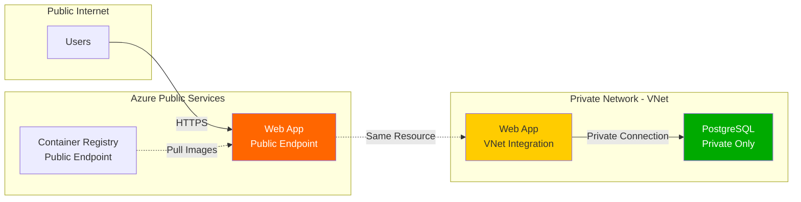

## Security Model

### Authentication & Authorization

1. **Service Principal**
   - Used by GitHub Actions for Azure authentication
   - Permissions: Contributor role on subscription
   - Credentials stored as GitHub Secrets

2. **Container Registry**
   - Admin credentials enabled for CI/CD
   - Credentials stored as GitHub Secrets
   - Username/password authentication

3. **Database Access**
   - PostgreSQL admin user: `notesadmin`
   - Password stored in:
     - Terraform variables (terraform.tfvars - gitignored)
     - GitHub Secrets (DB_PASSWORD)
     - App Service environment variables

### Network Security

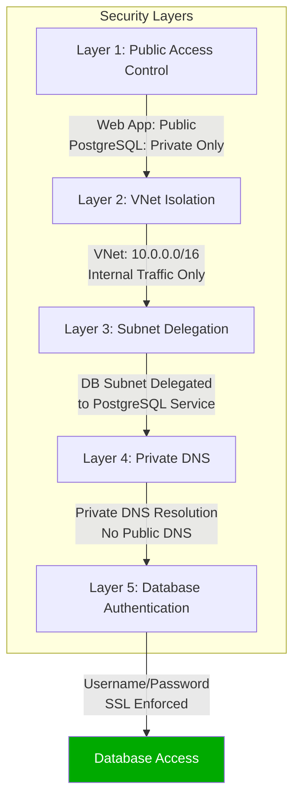

### Secrets Management

| Secret | Storage Location | Purpose |
|--------|-----------------|---------|
| `AZURE_CREDENTIALS` | GitHub Secrets | Service Principal credentials |
| `ARM_CLIENT_ID` | GitHub Secrets | Terraform Azure auth |
| `ARM_CLIENT_SECRET` | GitHub Secrets | Terraform Azure auth |
| `ARM_TENANT_ID` | GitHub Secrets | Terraform Azure auth |
| `ARM_SUBSCRIPTION_ID` | GitHub Secrets | Terraform Azure auth |
| `DB_PASSWORD` | GitHub Secrets, terraform.tfvars | PostgreSQL admin password |
| `ACR_USERNAME` | GitHub Secrets | Container registry login |
| `ACR_PASSWORD` | GitHub Secrets | Container registry password |
| `ACR_LOGIN_SERVER` | GitHub Secrets | Container registry URL |

## Data Flow

### Application Request Flow

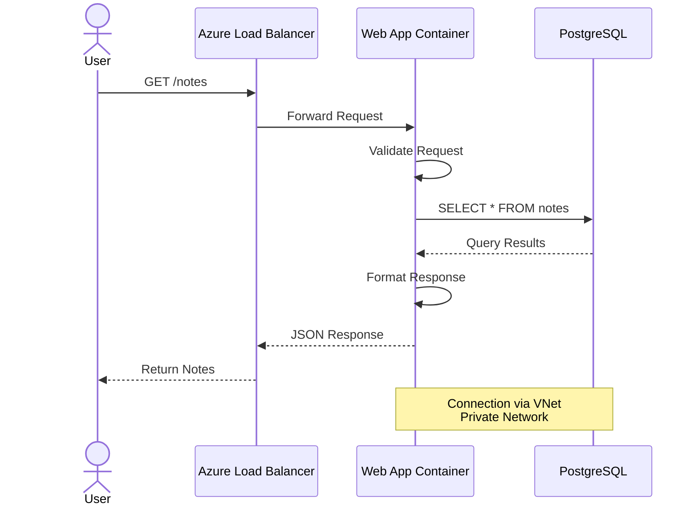

### CI/CD Deployment Flow

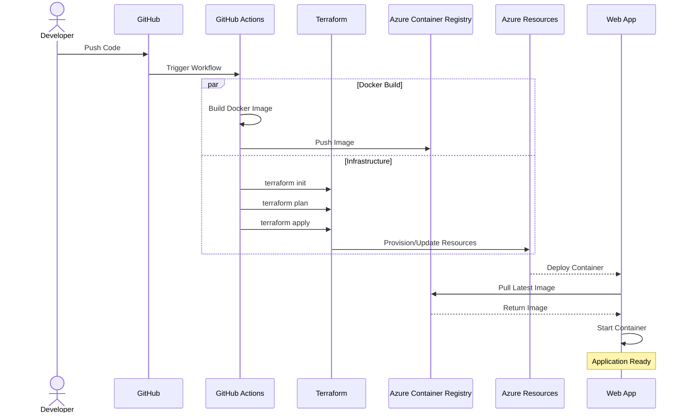

### Database Connection Flow

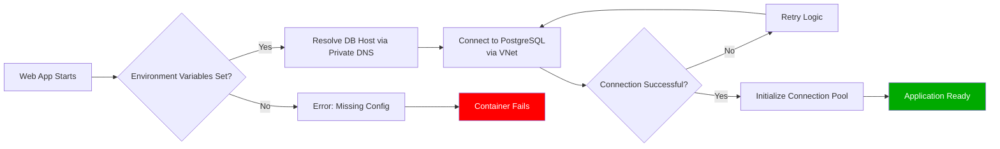

## Cost Optimization

### Current Configuration Costs (Approximate Monthly)

| Resource | SKU | Estimated Cost (USD) |
|----------|-----|---------------------|
| App Service Plan | B1 | ~$13 |
| PostgreSQL Flexible Server | B_Standard_B1ms | ~$12 |
| Container Registry | Basic | ~$5 |
| VNet | Standard | ~$0 (first 50GB free) |
| Private DNS | Standard | ~$0.50 |
| **Total** | | **~$30.50/month** |

### Optimization Recommendations

1. **Development Environment**
   - Use lower tiers during non-business hours
   - Consider Azure Dev/Test pricing
   - Implement auto-shutdown for non-production

2. **Production Scaling**
   - App Service: Scale up to P1V2+ for better performance
   - PostgreSQL: Enable zone redundancy for HA
   - ACR: Upgrade to Standard for geo-replication

## Disaster Recovery

### Backup Strategy

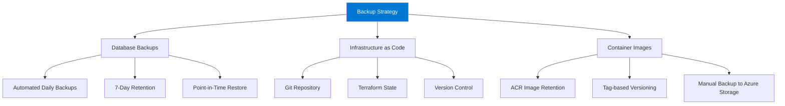

### Recovery Procedures

1. **Database Recovery**
   - Restore from automated backup
   - Point-in-time recovery available
   - RPO: 5 minutes, RTO: ~15 minutes

2. **Infrastructure Recovery**
   ```bash
   cd infra
   terraform apply -auto-approve
   ```

3. **Application Recovery**
   - Re-deploy from ACR
   - GitHub Actions workflow can be manually triggered
   - Rollback to previous image tag

## Monitoring & Observability

### Recommended Monitoring Setup

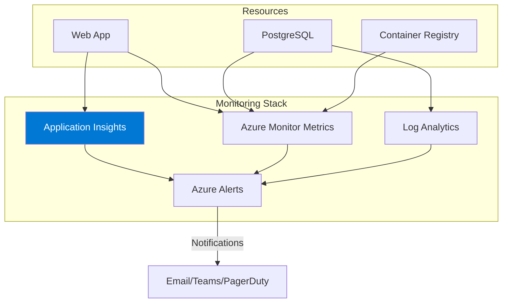

### Key Metrics to Monitor

1. **Application Performance**
   - Response time
   - Request rate
   - Error rate
   - CPU/Memory usage

2. **Database Performance**
   - Connection count
   - Query performance
   - Storage usage
   - CPU utilization

3. **Container Registry**
   - Pull rate
   - Storage usage
   - Image scan results

## Scaling Considerations

### Horizontal Scaling

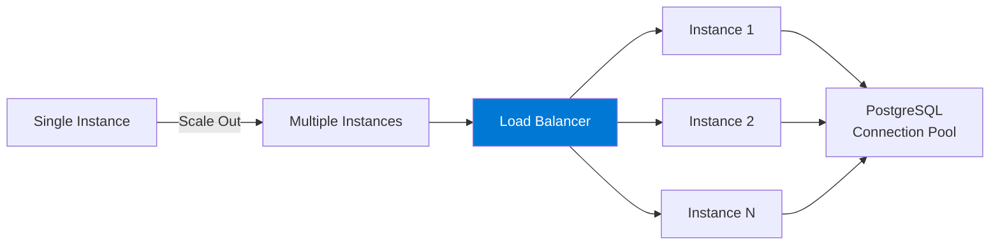

### Vertical Scaling

| Component | Current | Recommended Upgrade Path |
|-----------|---------|-------------------------|
| App Service | B1 | B2 → P1V2 → P2V2 |
| PostgreSQL | B_Standard_B1ms | B_Standard_B2s → GP_Standard_D2s_v3 |
| ACR | Basic | Standard → Premium |

---

**Document Version**: 1.0  
**Last Updated**: November 8, 2025  
**Author**: DevOps Team  
**Review Date**: Quarterly
