# Deployment Guide

## Table of Contents
- [Prerequisites](#prerequisites)
- [Initial Setup](#initial-setup)
- [CI/CD Pipeline](#cicd-pipeline)
- [Manual Deployment](#manual-deployment)
- [Configuration Management](#configuration-management)
- [Deployment Workflows](#deployment-workflows)

## Prerequisites

### Required Tools
- **Azure CLI** (v2.50+)
- **Terraform** (v1.5+)
- **Docker** (v20.10+)
- **Git**
- **Node.js** (v18+) - for local development

### Required Access
- Azure subscription with Contributor access
- GitHub repository access
- Service Principal with appropriate permissions

### Azure Quotas
Ensure your subscription has the following quotas in the target region:
- Basic App Service Plans: At least 1
- PostgreSQL Flexible Servers: At least 1
- Virtual Network: At least 1
- Container Registries: At least 1

## Initial Setup

### 1. Azure Service Principal Creation

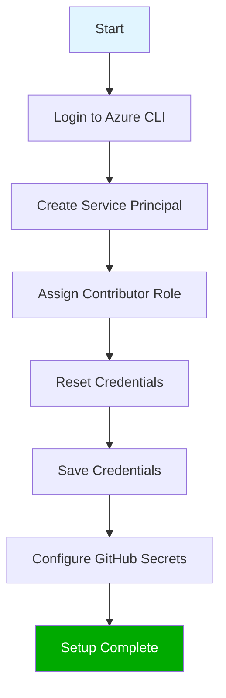

#### Commands

```bash
# Login to Azure
az login

# Create service principal
az ad sp create-for-rbac \
  --name "github-actions-sp" \
  --role contributor \
  --scopes /subscriptions/<SUBSCRIPTION_ID> \
  --sdk-auth

# Reset credentials if needed
az ad sp credential reset \
  --id <APP_ID> \
  --query password -o tsv
```

### 2. GitHub Secrets Configuration

Navigate to your GitHub repository → Settings → Secrets and variables → Actions

| Secret Name | Description | How to Obtain |
|-------------|-------------|---------------|
| `AZURE_CREDENTIALS` | Full JSON output from `az ad sp create` | Copy entire JSON output |
| `ARM_CLIENT_ID` | Service Principal App ID | From JSON: `clientId` |
| `ARM_CLIENT_SECRET` | Service Principal Secret | From JSON: `clientSecret` |
| `ARM_TENANT_ID` | Azure Tenant ID | From JSON: `tenantId` |
| `ARM_SUBSCRIPTION_ID` | Azure Subscription ID | From JSON: `subscriptionId` |
| `DB_PASSWORD` | PostgreSQL admin password | Choose a strong password |
| `ACR_LOGIN_SERVER` | Container Registry URL | Get after first deployment |
| `ACR_USERNAME` | Container Registry username | Get after first deployment |
| `ACR_PASSWORD` | Container Registry password | Get after first deployment |

### 3. Local Configuration

#### terraform.tfvars
Create `infra/terraform.tfvars` (gitignored):

```hcl
prefix      = "notesapp"
env         = "dev"
location    = "westeurope"  # Change if needed
db_password = "YourSecurePassword123!"
```

#### .env.local
Create `.env.local` in the root (gitignored):

```env
DB_PASSWORD=YourSecurePassword123!
```

## CI/CD Pipeline

### Pipeline Overview

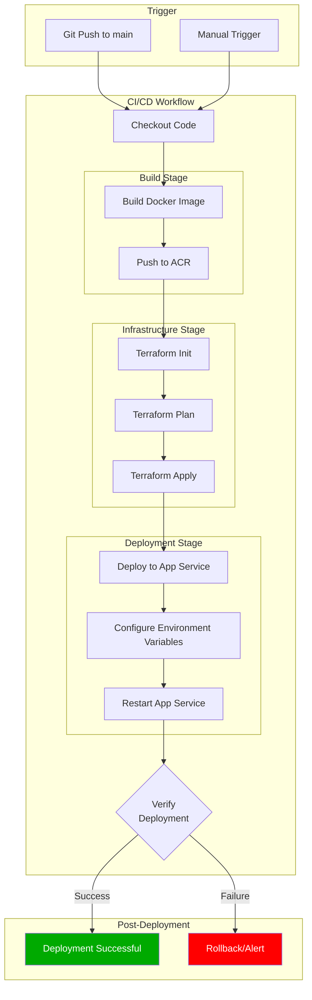

### Workflow File Structure

The CI/CD workflow is defined in `.github/workflows/ci-cd.yml`:

```yaml
name: CI/CD Pipeline
on:
  push:
    branches: [main]
  workflow_dispatch:

jobs:
  build-and-deploy:
    runs-on: ubuntu-latest
    steps:
      # 1. Build Docker image
      # 2. Push to ACR
      # 3. Deploy infrastructure
      # 4. Configure application
```

### Deployment Stages Explained

#### Stage 1: Docker Build & Push

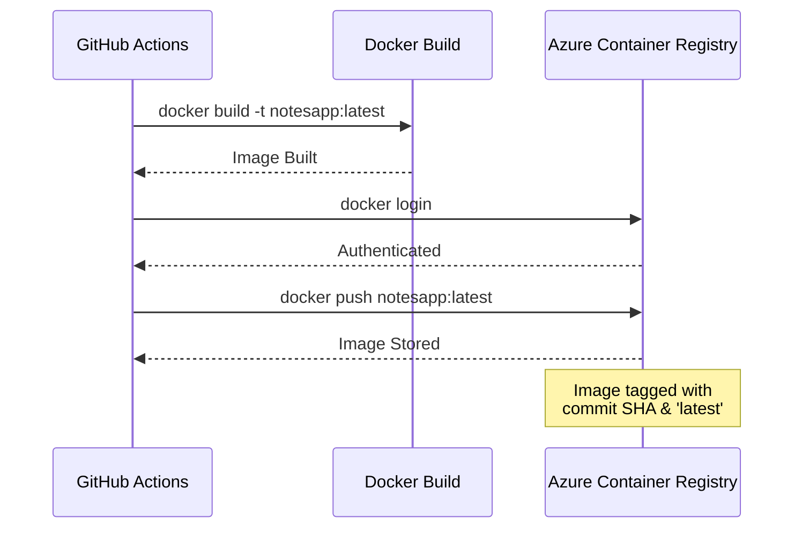

#### Stage 2: Infrastructure Provisioning

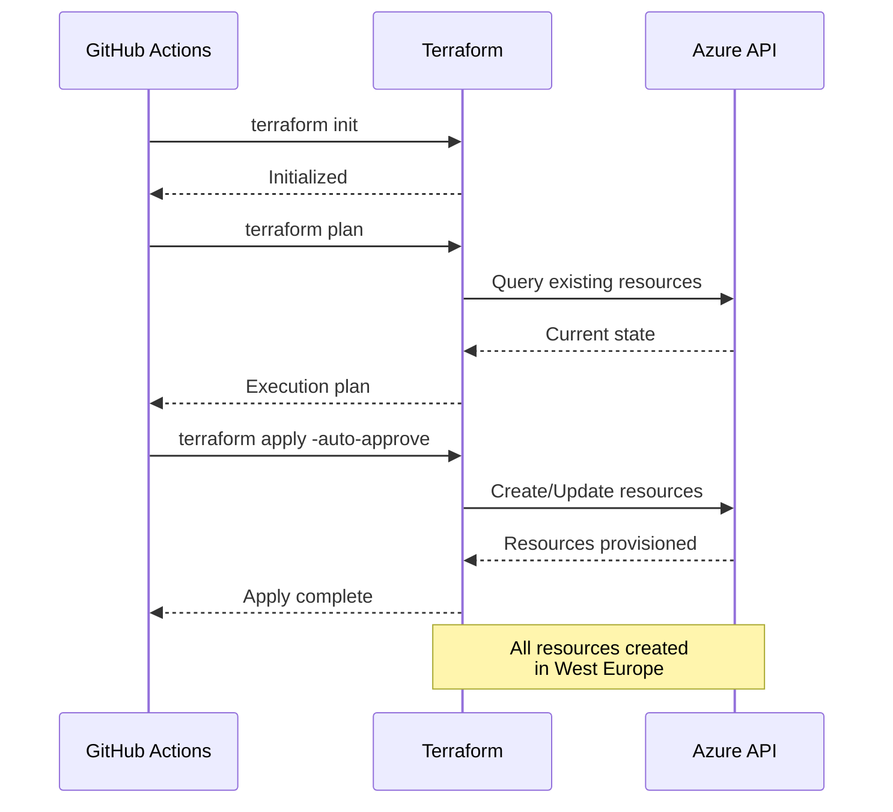

#### Stage 3: Application Deployment

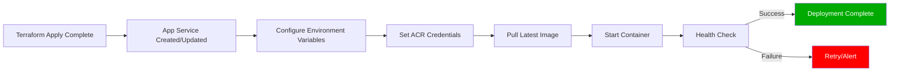

### Environment Variables Auto-Configuration

The pipeline automatically configures:

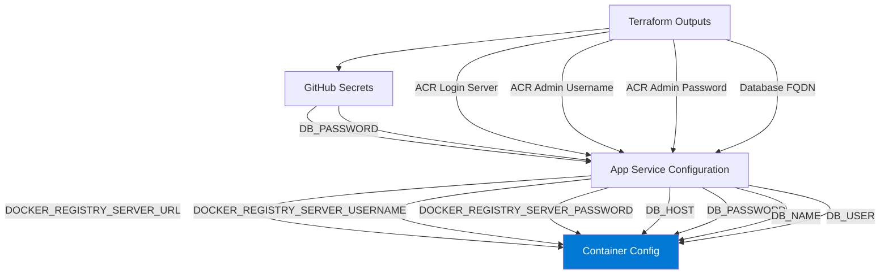

## Manual Deployment

### Prerequisites Check

```bash
# Verify Azure CLI login
az account show

# Verify Terraform installation
terraform version

# Verify Docker
docker version
```

### Step-by-Step Manual Deployment

#### 1. Infrastructure Deployment

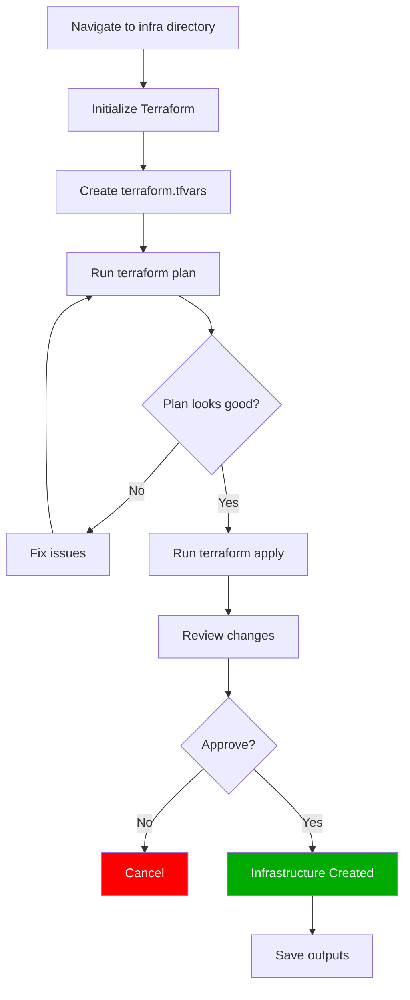

```bash
# 1. Navigate to infrastructure directory
cd infra

# 2. Initialize Terraform
terraform init

# 3. Plan infrastructure
terraform plan -out=tfplan

# 4. Apply infrastructure
terraform apply tfplan

# 5. Get outputs
terraform output
```

#### 2. Build and Push Docker Image

```bash
# 1. Login to Azure Container Registry
az acr login --name notesappdevacr

# 2. Build Docker image
docker build -t notesappdevacr.azurecr.io/notesapp:latest .

# 3. Push to ACR
docker push notesappdevacr.azurecr.io/notesapp:latest

# 4. Verify image
az acr repository show -n notesappdevacr --repository notesapp
```

#### 3. Configure App Service

```bash
# Set environment variables
az webapp config appsettings set \
  --resource-group notesapp-dev-rg \
  --name notesapp-dev-app \
  --settings \
    DB_HOST="<postgres-fqdn>" \
    DB_USER="notesadmin" \
    DB_PASSWORD="<your-password>" \
    DB_NAME="notesdb" \
    DB_PORT="5432" \
    DB_SSL="true"

# Restart app service
az webapp restart \
  --resource-group notesapp-dev-rg \
  --name notesapp-dev-app
```

#### 4. Verify Deployment

```bash
# Get app URL
APP_URL=$(az webapp show \
  --resource-group notesapp-dev-rg \
  --name notesapp-dev-app \
  --query defaultHostName -o tsv)

# Test health endpoint
curl https://$APP_URL/health

# Test notes endpoint
curl https://$APP_URL/notes
```

## Configuration Management

### Terraform Variables

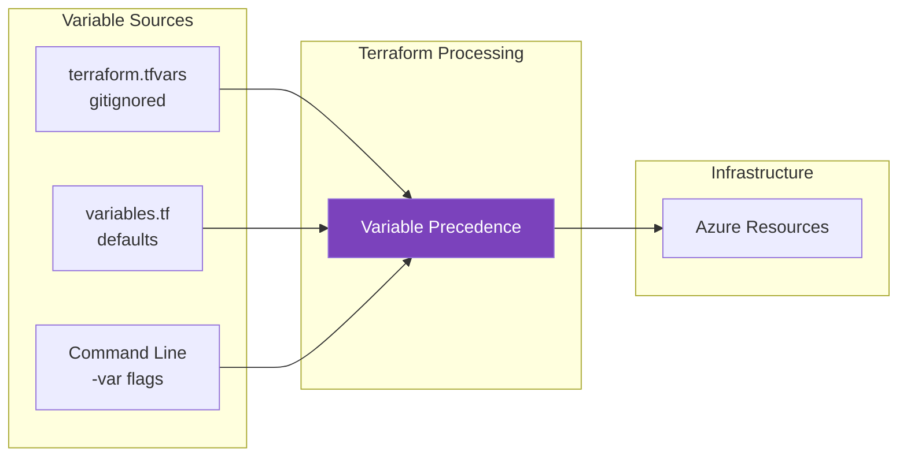

### Variables Reference

| Variable | Type | Default | Description |
|----------|------|---------|-------------|
| `prefix` | string | "notesapp" | Resource name prefix |
| `env` | string | "dev" | Environment name |
| `location` | string | "westeurope" | Azure region |
| `db_password` | string (sensitive) | none | PostgreSQL password |
| `image_tag` | string | "latest" | Docker image tag |

### Secret Injection Flow

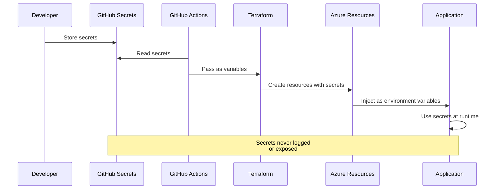

## Deployment Workflows

### First-Time Deployment

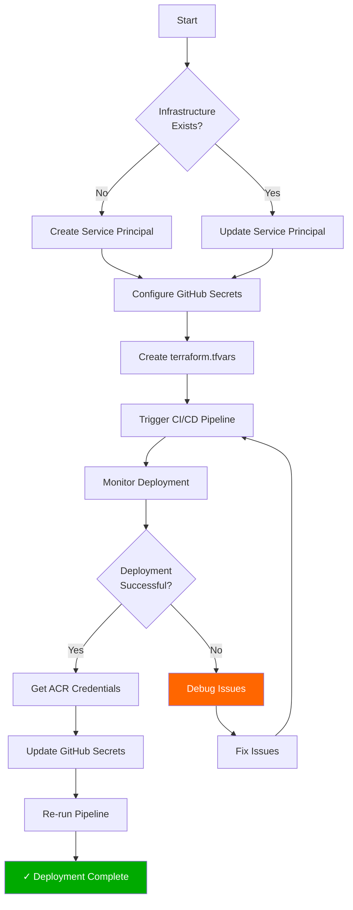

### Update Deployment

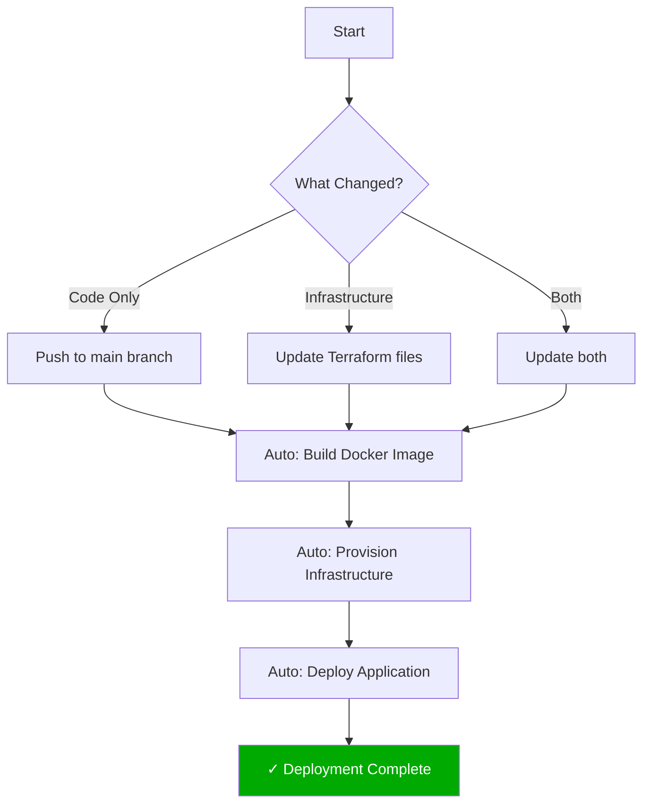

### Rollback Procedure

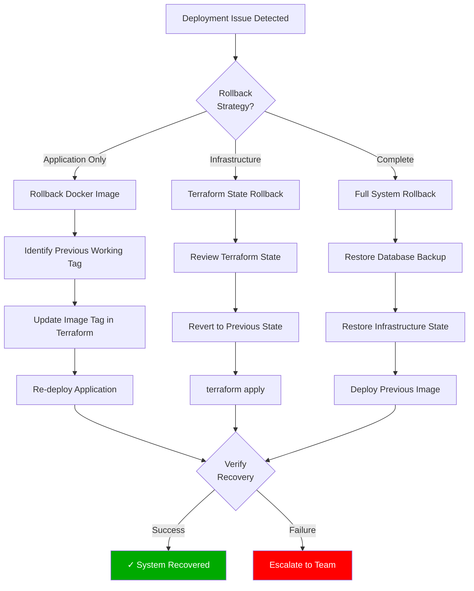

### Rollback Commands

```bash
# Rollback to previous Docker image
az webapp config container set \
  --resource-group notesapp-dev-rg \
  --name notesapp-dev-app \
  --docker-custom-image-name notesappdevacr.azurecr.io/notesapp:<previous-tag>

# Rollback Terraform state
cd infra
terraform state pull > backup.tfstate
# Edit state file if needed
terraform state push backup.tfstate
terraform apply

# Restore PostgreSQL database
az postgres flexible-server restore \
  --resource-group notesapp-dev-rg \
  --name notesapp-dev-pg-restored \
  --source-server notesapp-dev-pg \
  --restore-time "2025-11-08T10:00:00Z"
```

## Infrastructure Recreation Process

### Automated Recreation Script

The project includes an automated recreation script at `scripts/recreate-infrastructure.sh`:

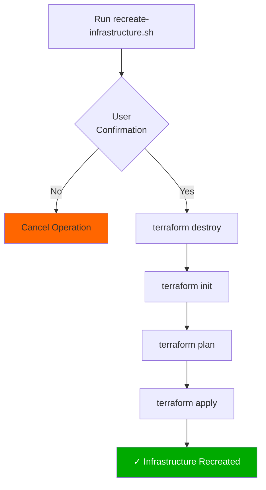

Usage:
```bash
cd /Users/haos/Projects/azure-psql-app
./scripts/recreate-infrastructure.sh
```

### Migration Between Regions

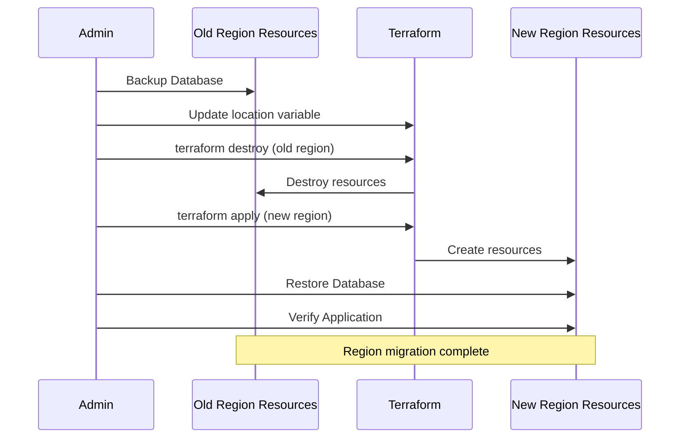

## Post-Deployment Verification

### Health Check List

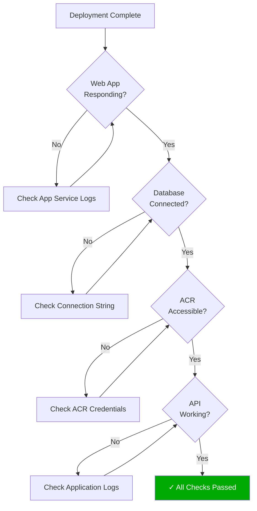

### Verification Commands

```bash
# 1. Check App Service status
az webapp show \
  --resource-group notesapp-dev-rg \
  --name notesapp-dev-app \
  --query state

# 2. Check PostgreSQL status
az postgres flexible-server show \
  --resource-group notesapp-dev-rg \
  --name notesapp-dev-pg \
  --query state

# 3. Test application endpoints
APP_URL=$(terraform output -raw app_url 2>/dev/null || echo "notesapp-dev-app.azurewebsites.net")
curl -f https://$APP_URL/health || echo "Health check failed"
curl -f https://$APP_URL/notes || echo "API check failed"

# 4. Check application logs
az webapp log tail \
  --resource-group notesapp-dev-rg \
  --name notesapp-dev-app

# 5. Check database connectivity
az postgres flexible-server connect \
  --name notesapp-dev-pg \
  --admin-user notesadmin
```

## Troubleshooting Common Issues

See [TROUBLESHOOTING.md](./TROUBLESHOOTING.md) for detailed troubleshooting guide.

---

**Document Version**: 1.0  
**Last Updated**: November 8, 2025  
**Next Review**: February 8, 2026
