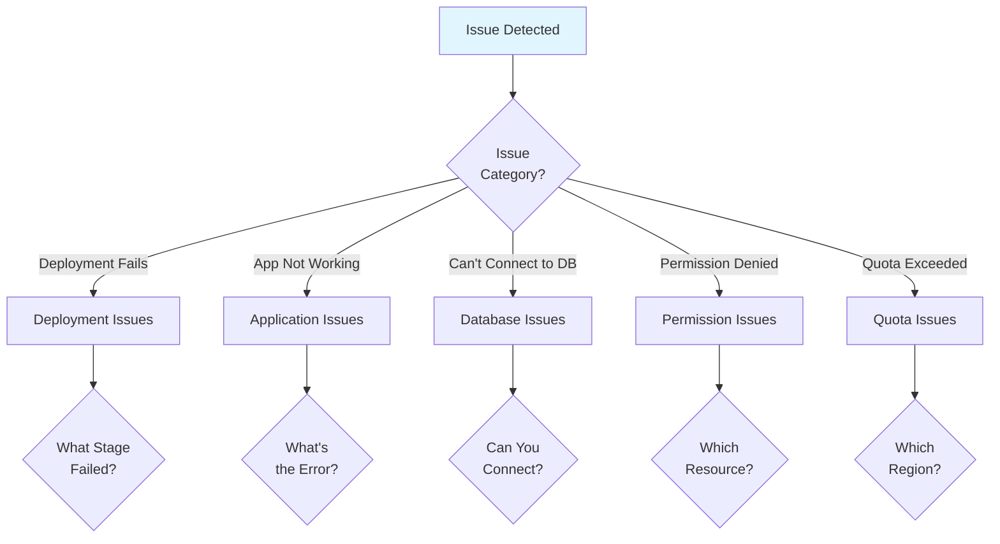
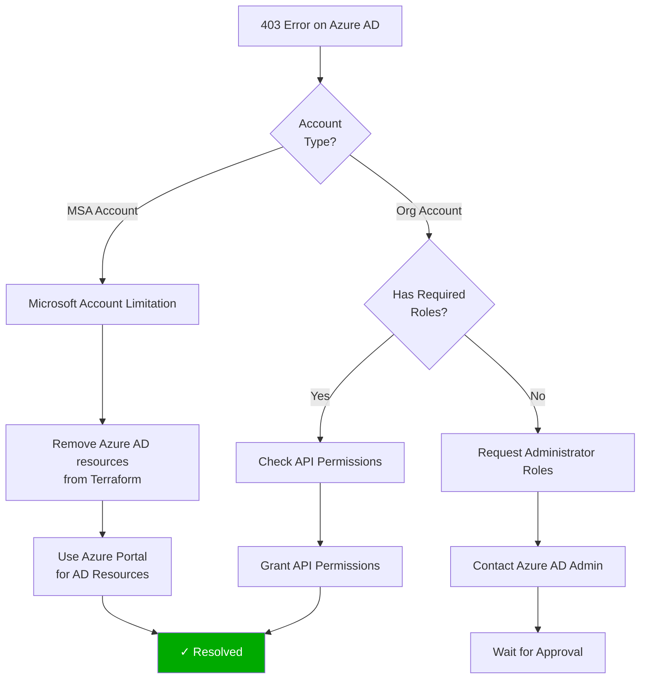
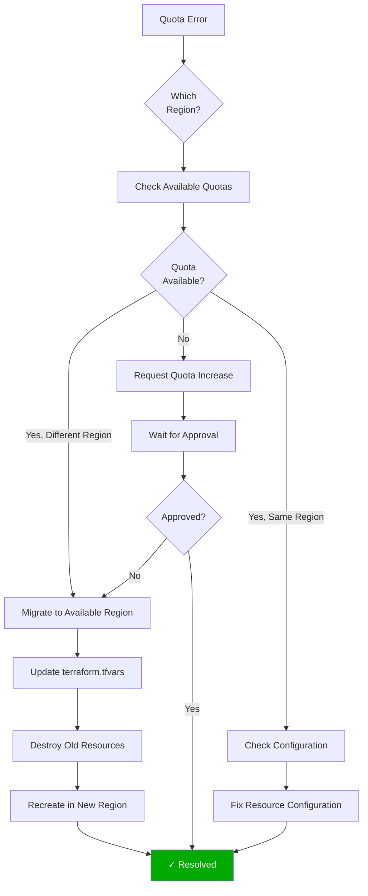
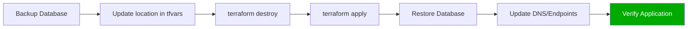
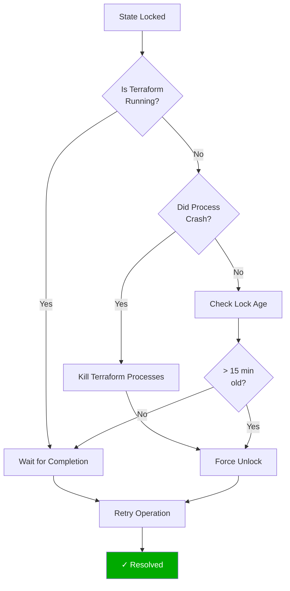
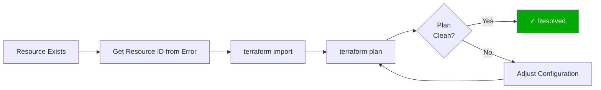
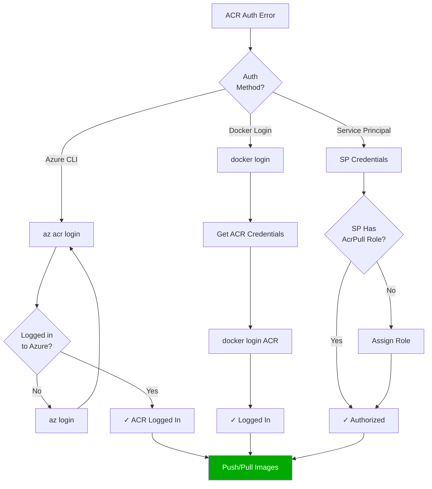
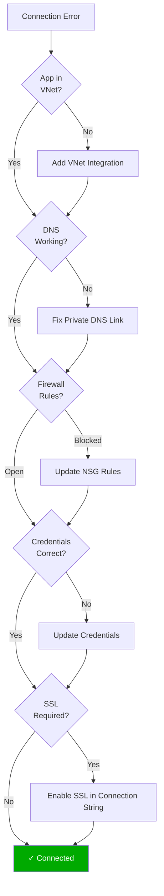
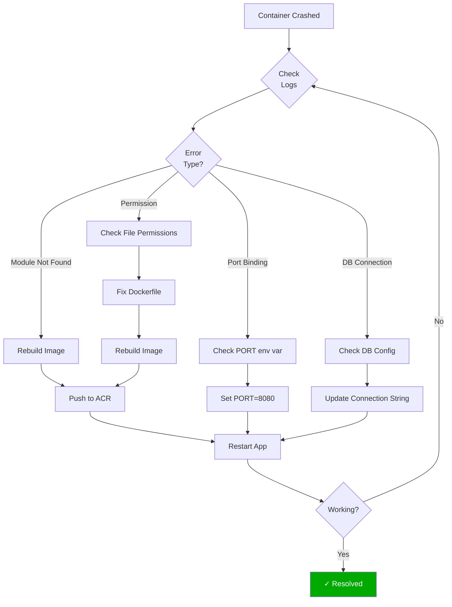
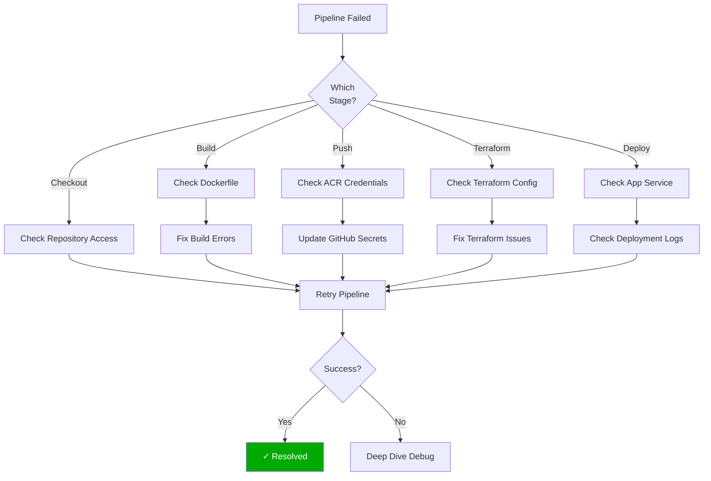

# Troubleshooting Guide

## Table of Contents
- [Common Issues](#common-issues)
- [Azure AD Permissions](#azure-ad-permissions)
- [Region and Quota Issues](#region-and-quota-issues)
- [Terraform State Issues](#terraform-state-issues)
- [Container Registry Issues](#container-registry-issues)
- [Database Connection Issues](#database-connection-issues)
- [Application Deployment Issues](#application-deployment-issues)
- [Network and VNet Issues](#network-and-vnet-issues)
- [CI/CD Pipeline Failures](#cicd-pipeline-failures)

## Common Issues

### Issue Decision Tree



## Azure AD Permissions

### Issue: "Authorization_RequestDenied: Insufficient privileges"

**Error Message:**
```
ApplicationsClient#Create: Failure responding to request: 
StatusCode=403 -- Original Error: autorest/azure: 
error response cannot be parsed: "" error: EOF HTTP 403 
Forbidden: Authorization_RequestDenied
```

**Cause:**
- Using a Microsoft Account (MSA) instead of organizational account
- Service Principal lacks Azure AD permissions
- Attempting to create Azure AD resources without proper roles

#### Decision Flow



**Solutions:**

1. **Remove Azure AD Resources from Terraform** (Recommended for MSA accounts)
   ```bash
   # Comment out Azure AD resources in main.tf
   # These resources are now managed manually:
   # - azuread_application
   # - azuread_service_principal
   # - azuread_service_principal_password
   ```

2. **Use Organizational Account**
   ```bash
   # Login with organizational account
   az login --tenant <your-org-tenant-id>
   ```

3. **Request Required Roles**
   - **Application Administrator**: To create applications
   - **Cloud Application Administrator**: Alternative role
   - **Global Administrator**: Full access (use cautiously)

**Prevention:**
- Use Service Principals with pre-created Azure AD resources
- Document which resources require manual setup
- Separate Azure AD management from infrastructure provisioning

---

## Region and Quota Issues

### Issue: "LocationIsOfferRestricted" or Quota Exceeded

**Error Messages:**
```
Error: creating PostgreSQL Flexible Server: 
Code="LocationIsOfferRestricted" 
Message="Location 'eastus' is not offer restricted"

Error: creating Linux Web App:
Code="Unauthorized" 
Message="Basic VMs quota limit 0 reached for subscription"
```

#### Region Quota Decision Tree



**Solutions:**

1. **Check Available Regions**
   ```bash
   # List regions with PostgreSQL Flexible Server availability
   az postgres flexible-server list-skus --location eastus
   az postgres flexible-server list-skus --location westeurope
   
   # List regions with App Service availability
   az appservice list-locations --sku B1
   ```

2. **Migrate to Different Region**
   ```bash
   # Update terraform.tfvars
   location = "westeurope"  # Change from "eastus"
   
   # Recreate infrastructure
   cd infra
   terraform destroy -auto-approve
   terraform apply -auto-approve
   ```

3. **Request Quota Increase**
   ```bash
   # Via Azure Portal:
   # 1. Go to Subscriptions
   # 2. Select your subscription
   # 3. Click "Usage + quotas"
   # 4. Find the specific quota
   # 5. Click "Request increase"
   ```

**Migration Checklist:**


**Regions Successfully Tested:**
- ✅ **West Europe**: All resources supported
- ❌ **East US**: Quota restrictions encountered
- ⚠️ **Other Regions**: Test before production use

---

## Terraform State Issues

### Issue: State Lock

**Error Message:**
```
Error: Error acquiring the state lock

Lock Info:
  ID:        c3650a59-0c88-f5b1-bff4-63d0ae9e491a
  Operation: OperationTypeApply
  Who:       user@machine
```

#### State Lock Resolution Flow



**Solutions:**

1. **Check for Running Processes**
   ```bash
   # Find running Terraform processes
   ps aux | grep terraform
   
   # Kill processes if needed
   pkill -9 terraform
   ```

2. **Force Unlock** (Use carefully)
   ```bash
   cd infra
   terraform force-unlock <LOCK_ID>
   ```

3. **Wait and Retry**
   ```bash
   # Wait a few minutes and try again
   sleep 60
   terraform apply
   ```

### Issue: Resource Already Exists

**Error Message:**
```
Error: A resource with the ID "/subscriptions/.../resourceGroups/..." 
already exists - to be managed via Terraform this resource needs to be 
imported into the State.
```

**Solution: Import Resources**



```bash
# Import existing resource
terraform import azurerm_resource_group.rg /subscriptions/<subscription-id>/resourceGroups/<rg-name>

# Import subnet
terraform import azurerm_subnet.db_subnet /subscriptions/<subscription-id>/resourceGroups/<rg-name>/providers/Microsoft.Network/virtualNetworks/<vnet-name>/subnets/<subnet-name>

# Verify
terraform plan
```

**Batch Import Script:**
```bash
#!/bin/bash
# Import all existing resources

SUBSCRIPTION_ID="86114ec0-54f1-4cf5-85f1-b561b90bbe0b"
RG="notesapp-dev-rg"

# Import Resource Group
terraform import azurerm_resource_group.rg \
  "/subscriptions/$SUBSCRIPTION_ID/resourceGroups/$RG"

# Import VNet
terraform import azurerm_virtual_network.vnet \
  "/subscriptions/$SUBSCRIPTION_ID/resourceGroups/$RG/providers/Microsoft.Network/virtualNetworks/notesapp-dev-vnet"

# Import Subnets
terraform import azurerm_subnet.db_subnet \
  "/subscriptions/$SUBSCRIPTION_ID/resourceGroups/$RG/providers/Microsoft.Network/virtualNetworks/notesapp-dev-vnet/subnets/notesapp-dev-db-subnet"

terraform import azurerm_subnet.app_subnet \
  "/subscriptions/$SUBSCRIPTION_ID/resourceGroups/$RG/providers/Microsoft.Network/virtualNetworks/notesapp-dev-vnet/subnets/notesapp-dev-app-subnet"
```

---

## Container Registry Issues

### Issue: Authentication Failed

**Error Message:**
```
Error response from daemon: Get https://notesappdevacr.azurecr.io/v2/: 
unauthorized: authentication required
```

#### ACR Authentication Flow



**Solutions:**

1. **Azure CLI Login**
   ```bash
   # Login to Azure
   az login
   
   # Login to ACR
   az acr login --name notesappdevacr
   ```

2. **Direct Docker Login**
   ```bash
   # Get credentials
   ACR_USERNAME=$(az acr credential show \
     --name notesappdevacr \
     --query username -o tsv)
   
   ACR_PASSWORD=$(az acr credential show \
     --name notesappdevacr \
     --query "passwords[0].value" -o tsv)
   
   # Docker login
   docker login notesappdevacr.azurecr.io \
     -u $ACR_USERNAME \
     -p $ACR_PASSWORD
   ```

3. **Update GitHub Secrets**
   ```bash
   # Get ACR credentials
   terraform output acr_login_server
   terraform output acr_admin_username
   
   # Update GitHub secrets:
   # ACR_LOGIN_SERVER
   # ACR_USERNAME
   # ACR_PASSWORD
   ```

### Issue: Image Not Found

**Error Message:**
```
Error: Failed to pull image "notesappdevacr.azurecr.io/notesapp:latest": 
manifest for notesappdevacr.azurecr.io/notesapp:latest not found
```

**Solution:**
```bash
# List available images
az acr repository list --name notesappdevacr

# List tags for repository
az acr repository show-tags \
  --name notesappdevacr \
  --repository notesapp

# Build and push if missing
docker build -t notesappdevacr.azurecr.io/notesapp:latest .
docker push notesappdevacr.azurecr.io/notesapp:latest
```

---

## Database Connection Issues

### Issue: Cannot Connect to PostgreSQL

**Error Message:**
```
Error: connection to server at "notesapp-dev-pg.postgres.database.azure.com", 
port 5432 failed: timeout expired
```

#### Database Connection Troubleshooting



**Solutions:**

1. **Verify VNet Integration**
   ```bash
   # Check if Web App is integrated with VNet
   az webapp vnet-integration list \
     --resource-group notesapp-dev-rg \
     --name notesapp-dev-app
   ```

2. **Check Private DNS**
   ```bash
   # Verify DNS zone link
   az network private-dns link vnet list \
     --resource-group notesapp-dev-rg \
     --zone-name notesapp-dev.postgres.database.azure.com
   ```

3. **Test Connection from Web App**
   ```bash
   # SSH into Web App container (if enabled)
   az webapp ssh --resource-group notesapp-dev-rg --name notesapp-dev-app
   
   # Test DNS resolution
   nslookup notesapp-dev-pg.postgres.database.azure.com
   
   # Test connection
   nc -zv notesapp-dev-pg.postgres.database.azure.com 5432
   ```

4. **Verify Connection String**
   ```bash
   # Get database FQDN
   terraform output database_fqdn
   
   # Check app settings
   az webapp config appsettings list \
     --resource-group notesapp-dev-rg \
     --name notesapp-dev-app \
     --query "[?name=='DB_HOST']"
   ```

5. **Enable SSL**
   ```javascript
   // In connection string, ensure:
   const config = {
     host: process.env.DB_HOST,
     user: process.env.DB_USER,
     password: process.env.DB_PASSWORD,
     database: process.env.DB_NAME,
     port: 5432,
     ssl: {
       rejectUnauthorized: false // For Azure PostgreSQL
     }
   };
   ```

---

## Application Deployment Issues

### Issue: Container Fails to Start

**Error in Logs:**
```
Error: Cannot find module 'express'
Container failed to start
Application has crashed
```

#### Container Startup Troubleshooting



**Solutions:**

1. **Check Application Logs**
   ```bash
   # Stream logs
   az webapp log tail \
     --resource-group notesapp-dev-rg \
     --name notesapp-dev-app
   
   # Download logs
   az webapp log download \
     --resource-group notesapp-dev-rg \
     --name notesapp-dev-app \
     --log-file app-logs.zip
   ```

2. **Verify Environment Variables**
   ```bash
   # List all app settings
   az webapp config appsettings list \
     --resource-group notesapp-dev-rg \
     --name notesapp-dev-app
   
   # Set missing variables
   az webapp config appsettings set \
     --resource-group notesapp-dev-rg \
     --name notesapp-dev-app \
     --settings PORT=8080
   ```

3. **Rebuild and Redeploy**
   ```bash
   # Rebuild image
   docker build -t notesappdevacr.azurecr.io/notesapp:latest .
   
   # Push to ACR
   docker push notesappdevacr.azurecr.io/notesapp:latest
   
   # Restart app service
   az webapp restart \
     --resource-group notesapp-dev-rg \
     --name notesapp-dev-app
   ```

---

## Network and VNet Issues

### Issue: Subnet Delegation Conflicts

**Error Message:**
```
Error: creating Subnet: subnets.SubnetsClient#CreateOrUpdate: 
Failure sending request: StatusCode=400 -- Original Error: 
Code="InUseSubnetCannotBeUpdated"
```

**Solution:**
```bash
# Delete and recreate subnet
az network vnet subnet delete \
  --resource-group notesapp-dev-rg \
  --vnet-name notesapp-dev-vnet \
  --name notesapp-dev-db-subnet

# Recreate with proper delegation
terraform apply -auto-approve
```

### Issue: VNet Integration Fails

**Solution:**
```bash
# Remove existing integration
az webapp vnet-integration remove \
  --resource-group notesapp-dev-rg \
  --name notesapp-dev-app

# Re-add integration
terraform apply -target=azurerm_linux_web_app.app -auto-approve
```

---

## CI/CD Pipeline Failures

### Issue: GitHub Actions Workflow Fails

#### Pipeline Failure Decision Tree



**Common Solutions:**

1. **Update GitHub Secrets**
   ```bash
   # Get current values
   terraform output
   az acr credential show --name notesappdevacr
   
   # Update in GitHub:
   # Settings → Secrets and variables → Actions
   ```

2. **Fix Terraform Formatting**
   ```bash
   cd infra
   terraform fmt -recursive
   terraform validate
   ```

3. **Test Locally First**
   ```bash
   # Test Docker build
   docker build -t test .
   
   # Test Terraform
   cd infra
   terraform plan
   ```

---

## Quick Reference Commands

### Emergency Rollback
```bash
# Rollback to previous image
az webapp config container set \
  --resource-group notesapp-dev-rg \
  --name notesapp-dev-app \
  --docker-custom-image-name notesappdevacr.azurecr.io/notesapp:<previous-tag>
```

### Complete Infrastructure Reset
```bash
cd infra
terraform destroy -auto-approve
terraform apply -auto-approve
```

### Get All Resource Status
```bash
az resource list \
  --resource-group notesapp-dev-rg \
  --output table
```

### Database Backup
```bash
# Create backup
az postgres flexible-server backup create \
  --resource-group notesapp-dev-rg \
  --name notesapp-dev-pg \
  --backup-name manual-backup-$(date +%Y%m%d)
```

---

**Document Version**: 1.0  
**Last Updated**: November 8, 2025  
**Covers Issues From**: Initial deployment through region migration
